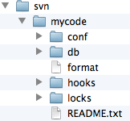

## SVN拉取命令某个目录或文件命令

```bash
#拉取整个版本库,包括所有历史命令
$ svn checkout url网址 --username=*** --password=*** path
		url : 服务器地址
		path: 要拷贝到电脑的哪个目录下
		
	# 范例
	$ svn checkout "https://xxxxx" --username=xxx --password=xxx "/Users/jingbin/test-svn"


# 下载单个文件或目录
$ svn export 远程服务端文件或目录 本地路径（可为空，则下载到当前位置） --username '用户名'
	# 范例
	$ svn export "https://xxxxx" --username=xxx --password=xxx "/Users/jingbin/test-svn"


从服务器端下载代码到客户端本地
在终端中输入
$ svn checkout svn://localhost/mycode --username=mj --password=123 /Users/apple/Documents/code

我解释下指令的意思：将服务器中mycode仓库的内容下载到/Users/apple/Documents/code目录中
```


## SVN更新服务器端的代码到客户端

```bash
$ cd  home/code
$ svn update
```


## SVN提交更改过的代码到服务器

```bash
# 将所有修改过的内容全部同步到服务器， 根据目录来区分
$ cd  home/code
$ svn commit -m  "提交注释"

可以看到终端的打印信息：
	Sending        weibo/weibo/main.m
	Transmitting file data .
	Committed revision 2.
```

## SVN上传文件或目录到服务器

```bash
$ svn import 本地文件或目录 远程服务端目录 --username '用户名' --password '密码' -m '添加描述(可为空)'   

	#范例
	$svn import  "/Users/本地文件或目录" "https://xxxxx" --username=xxx --password=xxx -m '新增文件'
```


## SVN将本地代码导入服务器_第一次服务器内容时初始化时使用

```bash
$ svn import /Users/apple/Documents/eclipse_workspace/weibo svn://localhost/mycode/weibo --username=mj --password=123 -m "初始化导入"

我解释下指令的意思：将/Users/apple/Documents/eclipse_workspace/weibo中的所有内容，上传到服务器mycode仓库的weibo目录下，后面双引号中的"初始化导入"是注释
```


## SVN服务器搭建_MACOS

```bash
# 实验环境  macos 12
我先在/User/apple目录下新建一个svn目录，以后可以在svn目录下创建多个仓库目录
打开终端，创建一个mycode仓库，输入指令：
$ svnadmin create /Users/apple/svn/mycode

指令执行成功后，会发现硬盘上多了个/Users/apple/svn/mycode目录，目录结构如下：
```



```ini
配置svn的用户权限

主要是修改/svn/mycode/conf目录下的三个文件
1.打开svnserve.conf，将下列配置项前面的#和空格都去掉

把下面几个选项前面的 # 都去掉
# anon-access = read
# auth-access = write
# password-db = passwd
# authz-db = authz

说明
anon-access = read代表匿名访问的时候是只读的，若改为anon-access = none代表禁止匿名访问，需要帐号密码才能访问
```

```ini
打开config/passwd，在[users]下面添加帐号和密码，比如：
# 帐号是mj，密码是123
[users]
mj = 123
jj = 456
```

```ini
打开authz，配置用户组和权限
我们可以将在passwd里添加的用户分配到不同的用户组里，以后的话，就可以对不同用户组设置不同的权限，没有必要对每个用户进行单独设置权限。

在[groups]下面添加组名和用户名，多个用户之间用逗号(,)隔开

[groups]
topgroup=mj,jj

#说明mj和jj都是属于topgroup这个组的，接下来再进行权限配置。
#使用[/]代表svn服务器中的所有资源库

[/]
@topgroup = rw
mj = rw

#上面的配置说明topgroup这个组中的所有用户对所有资源库都有读写(rw)权限，组名前面要用@
#如果是用户名，不用加@，比如mj这个用户有读写权限
#至于其他精细的权限控制，可以参考authz文件中的其他内容
```

```bash
4.启动svn服务器

前面配置了这么多，最关键还是看能否正常启动服务器，若启动不来，前面做再多工作也是徒劳。
在终端输入下列指令： $ svnserve -d -r /Users/apple/svn
或者输入：$ svnserve -d -r /Users/apple/svn/mycode

没有任何提示就说明启动成功了
```

```bash
5.关闭svn服务器

如果你想要关闭svn服务器，最有效的办法是打开实用工具里面的“活动监视器” ，结束 svnserver 进程
```

